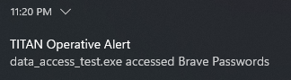

# TITAN Vigil

Lightweight Windows blue-team telemetry utility that detects **untrusted processes accessing protected filesystem resources** using Kernel ETW.

---



## What It Detects

The engine monitors kernel-level file I/O events and raises alerts when:

* An **untrusted or unsigned process**
* Attempts to **access a configured protected path**
* Including access via **handle duplication from trusted processes**

Typical protected targets include (configurable):

* Browser profile data (cookies, login databases)
* Application secrets stored on disk
* Token stores (e.g. LevelDB-based apps)
* Any sensitive filesystem location you define

---

## How It Works

* Starts a **Kernel ETW user trace** (process + file providers)
* Tracks process start events and caches process metadata
* Tracks file name mappings via ETW file events
* Matches accessed paths against configured protected rules
* Evaluates process trust using:

  * Authenticode signature verification
  * Optional signer allowlist
  * Optional legacy process-name allowlist
* Detects suspicious access patterns including:

  * Direct access by untrusted processes
  * Access via file objects originally opened by trusted processes
* Emits alerts through:

  * JSONL or text log file
  * Optional console output
  * Windows toast notifications (rate-limited)

---

## Requirements

* Windows
* Administrative privileges (required for Kernel ETW sessions)
* Rust toolchain (for building)

---

## Configuration

Configuration is provided via a TOML file.

Key concepts:

* **Protected rules**
  Substring-based path matching for sensitive resources.

* **Allowlists**

  * Certificate signer subject fragments
  * Legacy process name suffixes

* **General settings**

  * Alert suppression window
  * Quiet mode
  * JSONL vs text logging

Example (simplified):

```toml
[general]
quiet = false
jsonl = true
suppress_ms = 1500

[watch]
protected = [
  { name = "Browser Cookies", substring = "cookies" },
  { name = "Token Store", substring = "leveldb" }
]

[allowlist]
signer_subject_allow = ["microsoft", "google"]
process_name_allow = ["chrome.exe", "msedge.exe"]
```

---

## Running

```bash
cargo run --release -- --config config.toml
```

Verbose output:

```bash
cargo run --release -- --config config.toml --verbose
```

Logs are written to:

```
%LOCALAPPDATA%\TITAN-Vigil-CE\logs
```

---

## Alert Semantics

Each alert includes:

* Timestamp
* PID
* Process image path
* Target file path
* Protected rule name
* ETW event ID
* Alert kind (reason)
* Human-readable note

Alerts are **deduplicated and rate-limited** to avoid storms.

---

## Threat Model Fit

This tool is suited for:

* Host-based detection
* Suspicious process discovery
* Post-exploitation visibility
* Blue-team telemetry enrichment
