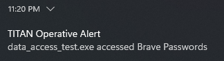

# TITAN Vigil

Windows blue-team telemetry utility that detects **untrusted processes accessing protected filesystem resources** using Kernel ETW, with enterprise-grade policy controls and SIEM-ready output formats.

---



## What It Detects

The engine monitors kernel-level file I/O events and raises alerts when:

* An **untrusted or unsigned process**
* Attempts to **access a configured protected path**
* Including access via **handle duplication from trusted processes**

Typical protected targets include (configurable):

* Browser profile data (cookies, login databases)
* Application secrets stored on disk
* Token stores (e.g. LevelDB-based apps)
* Any sensitive filesystem location you define

---

## How It Works

* Starts a **Kernel ETW user trace** (process + file providers)
* Tracks process start events and caches process metadata
* Tracks file name mappings via ETW file events
* Matches accessed paths against protected rules using deterministic indexed lookups
* Evaluates process trust using:

  * Authenticode signature verification
  * Optional certificate revocation checks (`security.revocation_mode = "chain"`)
  * Explicit denylist of known compromised signer certificate thumbprints
  * Optional signer allowlist
  * Optional legacy process-name allowlist fallback
* Detects suspicious access patterns including:

  * Direct access by untrusted processes
  * Access via file objects originally opened by trusted processes
* Emits alerts through:

  * JSONL / text / CEF / Sigma-JSON log sinks
  * Optional console output
  * Windows toast notifications (rate-limited)
  * Optional endpoint forwarding over UDP/TCP (feature-flagged)
* Uses bounded crossbeam channels and worker threads for sink processing/backpressure

---

## Requirements

* Windows
* Administrative privileges (required for Kernel ETW sessions)
* Rust toolchain (for building)

---

## Configuration

Configuration is provided via a TOML file.

Key concepts:

* **Protected rules**
  Substring-based path matching for sensitive resources.

* **Allowlists**

  * Certificate signer subject fragments
  * Legacy process name suffixes

* **Security policy**

  * Signature requirement toggle
  * Revocation mode
  * Compromised cert thumbprint denylist
  * Legacy fallback policy

* **Concurrency policy**

  * Worker thread count
  * Channel capacity for burst control

* **Endpoint alert forwarding**

  * Feature flag (`endpoint_alert.enabled`)
  * UDP/TCP endpoint packet forwarding

* **SIEM and Sigma**

  * Multi-format outputs (`jsonl`, `text`, `cef`, `sigma_json`)
  * Optional Sigma rule artifact generation on startup

* **General settings**

  * Alert suppression window
  * Quiet mode
  * JSONL vs text logging

Example (simplified):

```toml
[general]
quiet = false
suppress_ms = 1500

[security]
require_signature = true
require_signer_allowlist = true
allow_legacy_process_name_fallback = false
revocation_mode = "chain"
denylisted_cert_thumbprints = []

[concurrency]
worker_threads = 4
alert_channel_capacity = 8192

[endpoint_alert]
enabled = false
endpoint = "127.0.0.1:9000"
transport = "udp"
connect_timeout_ms = 1500
retries = 2

[siem]
enabled = true
formats = ["jsonl", "cef", "sigma_json"]
generate_sigma_rules = true
sigma_rules_file = "sigma_rules.yml"

[watch]
protected = [
  { name = "Browser Cookies", substring = "cookies" },
  { name = "Token Store", substring = "leveldb" }
]

[allowlist]
signer_subject_allow = ["microsoft", "google"]
process_name_allow = ["chrome.exe", "msedge.exe"]
```

---

## Running

```bash
cargo run --release -- --config config.toml
```

Verbose output:

```bash
cargo run --release -- --config config.toml --verbose
```

Logs are written to:

```
%LOCALAPPDATA%\TITAN-Vigil-CE\logs
```

When `siem.generate_sigma_rules = true`, a Sigma rules artifact is also generated in the same log directory (or the configured absolute path).

---

## Alert Semantics

Each alert includes:

* Timestamp
* PID
* Process image path
* Target file path
* Protected rule name
* ETW event ID
* Alert kind (reason)
* Human-readable note

Alerts are **deduplicated and rate-limited** to avoid storms.

---

## Threat Model Fit

This tool is suited for:

* Host-based detection
* Suspicious process discovery
* Post-exploitation visibility
* Blue-team telemetry enrichment
